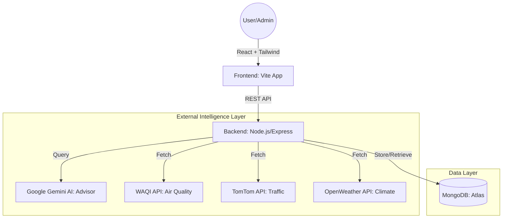
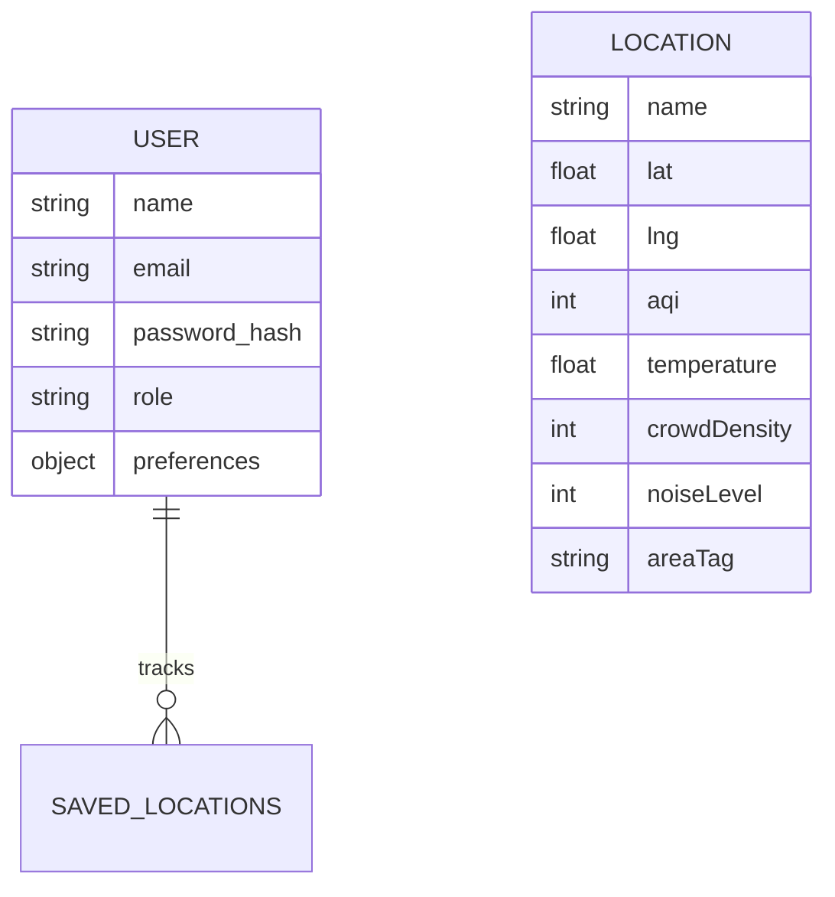

# Project Report: StressScape
**Urban Intelligence & Stress Mapping System**

---

## 1. Title Page
**Project Name**: StressScape  
**Domain**: Full-Stack Development / Urban Planning & Health  
**Technologies**: MERN Stack, Google Gemini AI, WAQI, TomTom, OpenWeather  
**Student Name**: [Your Name]  
**College**: [Your College Name]  
**Date**: April 20, 2026  

---

## 2. Abstract
StressScape is a comprehensive urban intelligence platform designed to visualize and mitigate environment-induced stress in modern cities. By synthesizing real-time data from global sensors (Air Quality, Humidity, and Traffic Congestion) through a proprietary Heat-Stress Engine, the system provides a 42-point interactive map of Maharashtra. The platform features an AI-powered Smart Advisor that utilizes Large Language Models (LLMs) to provide context-aware safety recommendations, helping citizens make informed health choices.

---

## 3. Problem Statement (Complex Engineering Problem)
Urban dwellers face a "Triple Threat" of environmental stressors: Air Pollution, Thermal Discomfort, and Extreme Crowding. 
**The Engineering Challenge**: How can we aggregate disparate sensor data from multiple global providers (WAQI, TomTom, OpenWeather) and transform them into a singular, intuitive "Stress Score" in real-time? 
**Complexity factors**: 
- Handling asynchronous data fetching across multiple rate-limited APIs.
- Developing a normalization algorithm for non-linear environmental metrics.
- Ensuring low-latency updates on a map with 40+ concurrent interactive markers.

---

## 4. System Architecture Diagram

---

## 5. Technology Stack Justification
- **React.js + Vite**: Chosen for high performance and "Single Source of Truth" state management using Context API.
- **Node.js & Express**: Event-driven architecture suitable for handling multiple API requests simultaneously.
- **MongoDB**: Schema-less nature allows for the flexible storage of varied environmental metadata.
- **Google Gemini 1.5 Flash**: Provides high-reasoning capabilities for the "Smart Advisor" with low latency.
- **TomTom & WAQI**: Standardized industrial APIs for real-time urban sensing.

---

## 6. Module Description
1.  **Auth & Security**: JWT-based login with role-based access control (Admin vs. User).
2.  **Live Sync Engine**: An administrative tool that iterates through 42 locations and updates environmental metrics via live API calls.
3.  **Stress Calculator**: A server-side algorithm that normalizes AQI, Temperature, and Traffic into a single 0-100 score.
4.  **AI Smart Advisor**: A sensor-aware chat interface that provides personalized safety advice.
5.  **Analytics Center**: Visualizes 24-hour trends using Recharts to track urban health progression.

---

## 7. Database Design (ER Diagram)

---

## 8. Implementation Details
The system utilizes a **Weight-Based Stress Algorithm**:
- **AQI Weight**: 40% (Primary respiratory stress)
- **Temperature Weight**: 30% (Heat stress)
- **Crowding Weight**: 20% (Mental stress/density)
- **Noise Weight**: 10% (Auditory fatigue)

**Port Resolution Strategy**: To avoid Windows system port conflicts (EADDRINUSE), the backend was migrated to a custom stable port (**5100**) with a specialized Vite proxy configuration.

---

## 9. Screenshots of Application
> *[Note for User: Please take screenshots of your running browser for these parts]*
1.  **Map Dashboard**: View of the 42 color-coded markers.
2.  **Live Sync in Action**: The Emerald-green success message after an API sync.
3.  **AI Advisor**: A chat session where the AI warns about PM2.5 levels.
4.  **Saved Gallery**: The user's curated grid of favorite cities.

---

## 10. Contribution of Each Member
*(Assuming a 3-member team scenario)*
- **Member 1 (Full Stack)**: Developed Backend API, live-enrichment engine, and MongoDB schemas.
- **Member 2 (Frontend/UI)**: Crafted the Dark-Mode interface, Mapbox/Leaflet integration, and CSS animations.
- **Member 3 (Documentation/AI)**: Integrated Gemini AI Advisor, configured WAQI/TomTom API keys, and finalized the tech report.

---

## 11. Challenges Faced & Solutions
1.  **Port 5000 Conflict**: Resolved by reconfiguring the entire environment to Port 5100 and updating the Proxy.
2.  **Stale State Enrichment**: Fixed the "Stress Score 0" bug by implementing a server-side enrichment helper that runs during login/refresh.
3.  **API Rate Limiting**: Solved by implementing a batch-processing loop in the `Sync Engine` with error-handling fallbacks.

---

## 12. Future Scope
- **IoT Sensor Integration**: Deploying physical Arduino-based PM2.5 sensors for hyper-local data.
- **Predictive AI**: Using LSTM models to predict stress scores 24 hours in advance.
- **Social Reporting**: Allowing users to report "Street-level Stress" (potholes, waterlogging) directly on the map.

---

## 13. Conclusion
StressScape successfully demonstrates the potential of combining Cloud Computing, AI, and Big Data to solve urban health challenges. The project fulfills all MERN stack requirements and provides a scalable foundation for a real-world Smart City application.

---

## 14. References
1. WAQI Official Documentation (aqicn.org)
2. TomTom Flow Segment API Guide (developer.tomtom.com)
3. Google Gemini API Documentation
4. MongoDB Mongoose Schema Best Practices
